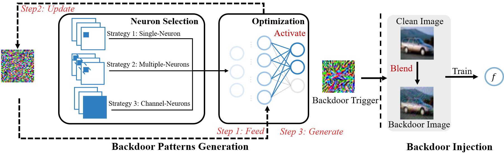
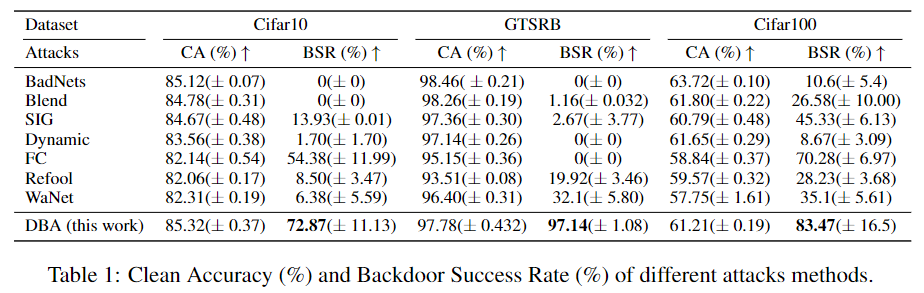

# Deep-Backdoor-Attack

## Pipeline

Deep Backdoor Attack (DBA) aims to generate deep-synchronized triggers that can alleviate the early-fitting phenomenon
## Playing with DBA
We provide a self-trained clean model *ResNet34-clean-91.tar* in the repository, which can be used to generate deep-synchronized trigger patterns

To play with the codes, simple run the following command to launch the attack

Step 1: Trigger Generation
```shell
python trigger_generation.py --cuda 1 --batch_size 1 train_or_test train
python trigger_generation.py --cuda 1 --batch_size 1 train_or_test test
```
This command will generate a series of trigger patterns by activating a specified neuron in the clean model. Then the trigger patterns will be superimposed on the clean images to construct poisoned samples.

Step 2: Backdoor Injection
```shell
python backdoor_train.py --cuda 1 --trigger_type "dba" --load_fixed_data 1
```
This command will start the standard backdoor training process, where the neural network model is trained on a mixture of poisoned samples and clean samples.

## Results
The following table presents the performance reported in our paper


